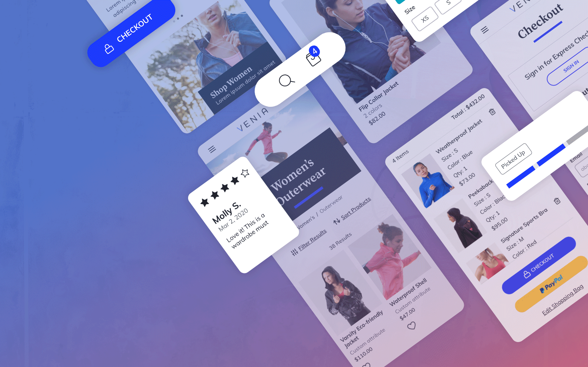

<Hero slots="image, icon, heading, text1, text2, buttons" variant="halfwidth" />

## PWA Studio XD Kit

**Expedite your Adobe Commerce storefront design.**

We’ve put together a collection of resources that are compatible with PWA Studio to help you kick-start your next storefront design in Adobe XD.
Just edit the provided assets, symbols, and templates to match your brand and experience.

* [Get the kit](/pwa-studio-uikit-venia-v1.1.xd)
* [View more UI kits](https://www.adobe.com/products/xd/features/ui-kits.html)

<TitleBlock slots="heading" width="100%" theme="light" />

### What's in the kit?

<TextBlock slots="heading, text" width="33%" theme="light" isCentered />

### Venia Theme

Our Venia theme for a B2C Apparel storefront includes a variety beautifully designed UI components.

<TextBlock slots="heading, text" width="33%" theme="light" isCentered />

### Commerce Themes

Over 10 core commerce templates, including Homepage, PLP, PDP, Checkout, and more.

<TextBlock slots="heading, text" width="33%" theme="light" isCentered />

### Design System

Over 80 design system components, including buttons, form fields, and more.

<TextBlock slots="heading, text" width="50%" theme="light" isCentered />

### Responsive Layouts

Support for both desktop and mobile breakpoints for responsive designs.

<TextBlock slots="heading, text" theme="light" width="50%" isCentered />

### Multiple Assets

A variety of editable XD assets you can use to support your branding with color swatches, fonts, and much more.
 

<TextBlock slots="heading, text, buttons" width="33%" theme="dark" isCentered/>

### Design Tutorial

In this introductory tutorial, you’ll build and preview your first project with Adobe XD to create great user experiences in just five easy steps.

* [View Tutorial](https://www.adobe.com/products/xd/learn/get-started-xd-design.html)

<TextBlock slots="heading, text, buttons" width="33%" theme="dark" isCentered />

### Prototypes Tutorial

In this tutorial, you’ll take a look at building out a fully interactive prototype with features like auto-animate, drag gestures, and speech recognition.

* [View Tutorial](https://www.adobe.com/products/xd/learn/get-started-xd-prototype.html)

<TextBlock slots="heading, text, buttons" width="33%" theme="dark" isCentered/>

### Components Tutorial

In this introductory tutorial, you'll build out a library of colors, character styles, and components to create a fully published Creative Cloud Library.

* [View Tutorial](https://www.adobe.com/products/xd/learn/get-started-xd-components-libraries.html)

<TextBlock slots="heading, text, buttons" width="50%" theme="dark" isCentered/>

### Collaboration Tutorial

In this introductory tutorial, you’ll learn the variety of ways you and your stakeholders can interact throughout the design to development process.

* [View Tutorial](https://www.adobe.com/products/xd/learn/get-started-xd-collaboration.html)

<TextBlock slots="heading, text, buttons" width="50%" theme="dark" isCentered/>

### E-Commerce Tutorial

This guide walks through the process of designing an e-commerce site using Adobe XD. From product page to checkout, you'll learn best practices along the way.

* [View Tutorial](https://www.adobe.com/products/xd/learn/design/layout/ecommerce-website-design.html)

<TextBlock slots="heading, text, buttons" width="50%" theme="light" isCentered/>

### PWA Studio on GitHub

Adobe's PWA Studio provides tools developers need to build complex Progressive Web Applications on top of Adobe Commerce and Magento Open Source stores.

* [PWA Studio on GitHub](https://github.com/magento/pwa-studio)

<TextBlock slots="heading, text, buttons" width="50%" theme="light" isCentered/>

### PWA Studio DevDocs

The PWA Studio developer documentation provides the introductory tutorials and reference documentation needed to build PWA applications for Adobe Commerce. 

* [PWA Studio DevDocs](https://magento.github.io/pwa-studio/)
